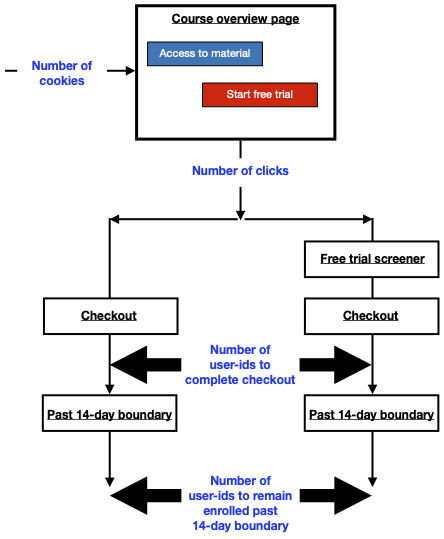
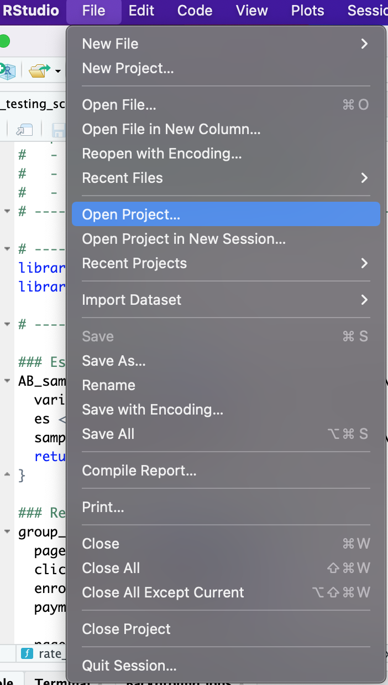

# Udacity AB Testing Final Project

This repo contains my R codes and report for the [Udacity A/B Testing Project](https://www.udacity.com/course/ab-testing--ud257), showcasing both my statistical knowledge and R programming skills. 
The full detailed analysis is [here](https://github.com/danicychao/Udacity_AB_testing_final_project/blob/main/AB_Testing_Final_Report.pdf), including the flowchart of the A/B experiment, metric selection and calculation, and hypothesis testing.

## Introduction

Udacity wants to improve the overall student experience. They come up with a new design, "free trial screener". Before they officially implement the free trial screener in the website, 
they want to test the free trial screener to see if it can really help them to improve student experience. Therefore, they launch this A/B testing experiment on the free trial screener
and collect the feedback from students. In this project, I analyse the A/B test results with R and further provide data-driven recommendation. 

Refer to [here](https://docs.google.com/document/u/1/d/1aCquhIqsUApgsxQ8-SQBAigFDcfWVVohLEXcV6jWbdI/pub) for more detail.

<p align="center">

</p>

## Notes

- Although retention is the most direct metric, it requires too many page views and will make the experiment take too long. Instead, I use gross conversion and net conversion as the evaluation metrics.

- Unlike the Bonferroni test, we want both the hypothesis tests on gross conversion and net conversion to pass. In other words, the Bonferroni is an "OR" condition, but our scenario here is an "AND" condition.

- I use the default `ES.h` function and `pwr.2p.test` function from the `pwr` package in R to estimate required sample size for sufficient statistical power. The estimated sample size is slightly different from the estimate of the famous [Evan Miller's A/B test sample size calculator](https://www.evanmiller.org/ab-testing/sample-size.html). The discrepancy mainly results from the different methods estimating the variance of control and experiment groups, which are both unknown. In this project, difference is around 1-2% in the sample size, practically negligible.

## Summary

- The A/B testing experiment setups are equivalent between the control and experiment groups.

- The hypothesis tests on gross conversion and net conversion indicate that the free trial screener is likely to improve student experience,
  but we have not yet collected enough page views to achieve sufficient statistical power.

- The free trial screener is actually a passive way to improve overall student experience. For students with higher probability to drop out,
  the free trial screener just triggers their bailing out at an earlier stage, so they will not be frustrated at the end.
  Udacity loses opportunity to make profits from those students. Udacity should also have strategies to encourage students stay on track and finish courses.

## R script usage

- Clone the repo using the SSH link, and open the repo directory in RStudio by "Open Project" in File.

  ```bash
  git clone git@github.com:danicychao/Udacity_AB_testing_final_project.git
  ```
  

- In RStudio console, install packages.

  ```R
  install.packages("pwr")
  install.packages("here")
  ```

- While running `AB_testing_script.R` line by line reproduces the results in my final report, the functions defined in the script, such as `AB_sample_size`, `Bernoulli_invariant_check`, and `AB_test`,
  can be easily adapted for one's own A/B tests. One can apply these funtions to their data of control and experiment group with the z-score corresponding to their test levels.

- In R, one can easily compute the z-score,

  ```R
  z_score <- qnorm(1 - alpha / 2)
  ```
  where `alpha` is the desired test levels. (I only use two-sided tests here.)

